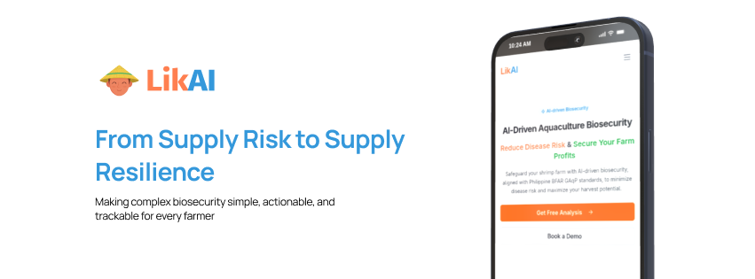

# LikAI: Predictable Supply from Compliant Farms



We're using AI to help Filipino shrimp farmers build resilient farms and secure future harvests. Our mission is to strengthen the entire Philippine aquaculture industry, one healthy farm at a time.

## Overview

LikAI is a B2B platform that gives processors the tools to turn their small shrimp aquafarm suppliers into a compliant, resilient, and fully traceable network. We do this through three core components:

- **AI-Powered Farmer Coaching**: At the heart of our platform is an AI coach that delivers value directly to the shrimp aquafarmer. It provides personalized, daily action plans, 24/7 expert guidance, and smart investment advice to make achieving GAqP compliance simple and affordable.

- **Supply Chain Monitoring for Processors**: We provide processors with real-time visibility into the biosecurity and compliance scores of their entire shrimp supplier network. This allows them to proactively manage risk and identify high-performing partners.

- **Automated Reporting & On-Chain Certification**: The platform automatically generates the auditable compliance reports needed for export and BFAR accreditation. Upon completion, a verifiable **"Accreditation-Ready"** certificate can be issued as an on-chain NFT, guaranteeing a new level of trust and traceability.

## ICP Features used

- **Canisters**: Decentralized App & Data Hosting
- **Internet Identity**: Secure Farmer & Processor Login
- **HTTP Outcalls**: External AI & Real-World Data Integration
- **Timers**: Automated Farmer Reminders & Reports
- **Asset Canister**: Verifiable On-Chain Certifications

## How LikAI Works

### Step 1: Processor-Led Onboarding

- Processors invite their entire network of small farm suppliers, solving farmer acquisition and ensuring immediate scale.

### Step 2: Personalized Plan Generation

- Each invited farmer completes a simple assessment and instantly receives a personalized, AI-generated action plan for GAqP compliance.

### Step 3: Guided Daily Management

- Farmers follow their daily plans with 24/7 support from our AI Coach, ensuring consistent and correct implementation of biosecurity best practices.

### Step 4: Automated Compliance Reporting

- The platform tracks all farmer activity and generates automated compliance reports for processors, providing the auditable proof needed for export accreditation.

### Step 5: Verifiable On-Chain Certification

- Upon completion, a tamper-proof "Accreditation-Ready" certificate is issued as an on-chain NFT, guaranteeing trust and traceability in the supply chain.

## Project Progress

### Feature 1: Onboarding Processes for Shrimp Farmer

**Frontend**

- ✅ The initial set of questions from the Good Aquaculture Practices (GAqP) handbook has been added.
- ✅ Improved the user navigation to provide a more seamless and intuitive experience
- ✅ Added a button that requires users to log in before generating AI reports. This will prevent the abuse of tokens. 
- ✅ We have added more visual icons to provide a more intuitive and user-friendly experience for shrimp farmers.
- ✅ Implemented ICP authentication, which now redirects users to the main dashboard upon a successful login.
- ✅ The data handling process for saving initial assessment questions has been improved to ensure data integrity before they are submitted to the AI model.
- ✅ Fixed visual bugs related to the buttons.

**Backend**

- ✅ Added Motoko database integration to the backend
- ✅ Added the KYC Canister.
- ✅ Added ICP Authentication.

**AI Model**

- ✅ Implemented RAG (Retrieval-Augmented Generation) pipeline using Groq LLM
- ✅ Integrated 3 official GAqP PDFs (635 pages) into vector database
- ✅ Created farm assessment endpoint with AI-generated recommendations
- ✅ Built AI chatbot for real-time farmer guidance with guardrails
- ✅ Added rate limiting and content filtering for responsible AI use

### Feature 2: Main Dashboard

**Frontend**

- ✅ We have added more visual icons to provide a more intuitive and user-friendly experience for shrimp farmers.
- ✅ added some UI bug fixes and enhancements.

### Feature 3: Dynamic GAqP Action Plan

**Frontend**

- ✅ We have added more visual icons to provide a more intuitive and user-friendly experience for shrimp farmers.
- ✅ New modules and supporting resources have been added to enhance the overall credibility of the application.
- ✅ added GAqP modules UI enhancements.

### Feature 4: AI Coach (Chatbot)

**Frontend**

- ✅ Interactive chatbot interface with LikAI Coach branding
- ✅ Real-time AI responses powered by RAG pipeline
- ✅ Quick action buttons for common farm questions
- ✅ Usage tracking with visual indicators (questions used/remaining)
- ✅ Mobile-responsive design matching application theme

**Backend**

- ✅ RAG pipeline integration with 3 GAqP PDF manuals (635 pages)
- ✅ Semantic search using ChromaDB vector database
- ✅ Groq LLM (Llama 3.1-8B-Instant) for answer generation
- ✅ Content filtering with 30+ aquaculture keywords
- ✅ Rate limiting: 20 questions/session, 3/minute
- ✅ Session tracking and logging for analytics

## Getting Started

## Project Structure

```
LikAI/
├── docs/                    # Documentations
├── frontend/                # React.js 19 with React Router v7 application
├── backend/                 
│   ├── api/                 # Motoko smart contracts
│   ├── ai_service/           # Python AI backend with RAG pipeline
│   │   ├── app.py           # FastAPI server
│   │   ├── modules/         # RAG pipeline components
│   │   ├── data/            # GAqP PDFs and vector database
│   │   └── requirements.txt # Python dependencies
│   └── storage/             # Data storage canisters
├── setup/                   # Scripts for installing dependencies and local deployment
├── public/                  # Images
```

### Technology Stack

**Frontend:**
- React 19 + React Router v7 + Radix UI + Tailwind CSS
- Build Tool: Vite

**Backend:**
- Blockchain: Internet Computer Protocol (ICP)
- Smart Contracts: Motoko
- AI Backend: Python + FastAPI
- LLM: Groq (Llama 3.1-8B-Instant)
- Vector DB: ChromaDB
- Embeddings: SentenceTransformers (all-MiniLM-L6-v2)

### Prerequisites

**Frontend & ICP:**
- Node.js (v18+ recommended)
- npm or yarn
- DFX (Internet Computer SDK)

**AI Backend:**
- Python 3.11+
- Groq API Key (free at https://console.groq.com/keys)

### Installation

#### 1. Clone the repository

```sh
git clone https://github.com/your-org/likai.git
cd likai
```

#### 2. Install Frontend Dependencies

```sh
npm run setup
```

#### 3. Setup AI Backend

```sh
cd backend/ai_service

# Create virtual environment
python -m venv venv

# Activate (Git Bash/Mac/Linux)
source venv/Scripts/activate
# Or PowerShell: venv\Scripts\activate

# Install dependencies
pip install -r requirements.txt

# Create .env file
echo "GROQ_API_KEY=your_groq_api_key_here" > .env

# Initialize vector database (first time only)
python initialize_vectordb.py
```

#### 4. Run Development Servers

**Terminal 1 - AI Backend:**
```sh
cd backend/ai_service
python app.py
# Server runs on http://localhost:8000
```

**Terminal 2 - Frontend:**
```sh
npm run dev
# Server runs on http://localhost:5173
```

#### 5. Open the application

- Frontend: [http://localhost:5173](http://localhost:5173)
- AI API Docs: [http://localhost:8000/docs](http://localhost:8000/docs)

### Running on the Local DFX NETWORK

To run the project in a local dfx network, you can use the command below

- To install all the dependencies, simply run the following:

```sh
bash setup/install.sh
# or 
zsh setup/install.sh # if you are using zsh
```

To run the project locally, simply run the following:

```sh
bash setup/deploy_local.sh
# or 
zsh setup/deploy_local.sh # if you are using zsh
```

### AI API Endpoints

**Farm Assessment** (http://localhost:8000)

- `POST /process-assessment` – Analyzes farm data and generates AI-powered biosecurity recommendations
  - Input: Farm details (species, type, water source, concerns, etc.)
  - Output: Overall score, category scores, personalized action plan
  - Features: RAG-powered recommendations based on 3 GAqP manuals

- `POST /query` – AI chatbot for farm-related questions (LikAI Coach)
  - Input: Natural language question
  - Output: AI-generated answer from GAqP manuals
  - Guardrails: 
    - Only answers aquaculture-related questions
    - Rate limit: 20 questions/session, 3 questions/minute
    - Content validation using 30+ farm keywords

- `GET /health` – Health check endpoint
- `GET /docs` – Interactive API documentation (Swagger UI)

**ICP Canisters**

- Coming soon: Motoko canister endpoints for on-chain data storage

### Deployment

**LikAI Main Network**: https://5btcw-oyaaa-aaaah-ark7a-cai.icp0.io/

### Contributing

1. Fork the repository.
2. Create your feature branch (`git checkout -b feature/my-feature`).
3. Commit your changes (`git commit -am 'Add new feature'`).
4. Push to the branch (`git push origin feature/my-feature`).
5. Open a pull request.

### License

This project is licensed under the [MIT LICENSE](LICENSE).

### Acknowledgments

- Internet Computer Protocol team
- ICP Hub Philippines Mentors
- DEVCON Philippines
- Open source contributors