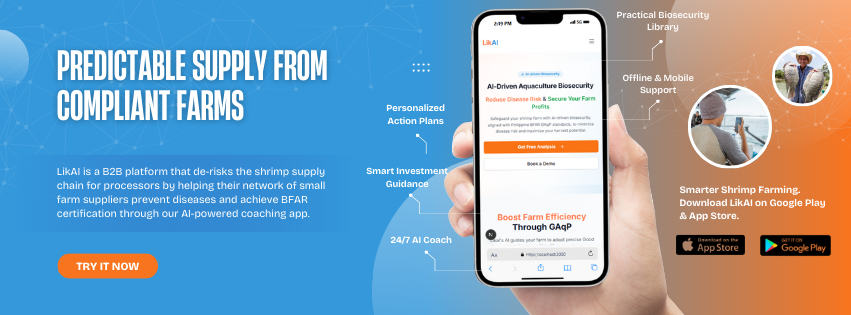

# LikAI: The Shrimp Farmer's Biosecurity Coach



We're using AI to help Filipino shrimp farmers build resilient farms and secure future harvests. Our mission is to strengthen the entire Philippine aquaculture industry, one healthy farm at a time.

## Overview

LikAI is a B2B platform that gives processors the tools to turn their small farm suppliers into a compliant, resilient, and fully traceable network. We do this through three core components:

- **AI-Powered Farmer Coaching**: At the heart of our platform is an AI coach that delivers value directly to the farmer. It provides personalized, daily action plans, 24/7 expert guidance, and smart investment advice to make achieving GAqP compliance simple and affordable.

- **Supply Chain Monitoring for Processors**: We provide processors with real-time visibility into the biosecurity and compliance scores of their entire supplier network. This allows them to proactively manage risk and identify high-performing partners.

- **Automated Reporting & On-Chain Certification**: The platform automatically generates the auditable compliance reports needed for export and BFAR accreditation. Upon completion, a verifiable "Accreditation-Ready" certificate can be issued as an on-chain NFT, guaranteeing a new level of trust and traceability.

## ICP Features used

- **Canisters**: Decentralized App & Data Hosting
- **Internet Identity**: Secure Farmer & Processor Login
- **HTTP Outcalls**: External AI & Real-World Data Integration
- **Timers**: Automated Farmer Reminders & Reports
- **Asset Canister**: Verifiable On-Chain Certifications

## How LikAI Works

### Step 1: Processor-Led Onboarding

- Processors invite their entire network of small farm suppliers, solving farmer acquisition and ensuring immediate scale.

### Step 2: Personalized Plan Generation

- Each invited farmer completes a simple assessment and instantly receives a personalized, AI-generated action plan for GAqP compliance.

### Step 3: Guided Daily Management

- Farmers follow their daily plans with 24/7 support from our AI Coach, ensuring consistent and correct implementation of biosecurity best practices.

### Step 4: Automated Compliance Reporting

- The platform tracks all farmer activity and generates automated compliance reports for processors, providing the auditable proof needed for export accreditation.

### Step 5: Verifiable On-Chain Certification

- Upon completion, a tamper-proof "Accreditation-Ready" certificate is issued as an on-chain NFT, guaranteeing trust and traceability in the supply chain.

## Project Progress

### Feature 1: Onboarding Processes for Shrimp Farmer

- ✅ The initial set of questions from the Good Aquaculture Practices (GAqP) handbook has been added.
- ✅ Improved the user navigation to provide a more seamless and intuitive experience
- ✅ Added a button that requires users to log in before generating AI reports. This will prevent the abuse of tokens. 
- ✅ We have added more visual icons to provide a more intuitive and user-friendly experience for shrimp farmers.
- ✅ Implemented ICP authentication, which now redirects users to the main dashboard upon a successful login.
- ✅ The data handling process for saving initial assessment questions has been improved to ensure data integrity before they are submitted to the AI model.
- ❌ Still in the process of making LikAI AI model.

### Feature 2: Main Dashboard

- ✅ We have added more visual icons to provide a more intuitive and user-friendly experience for shrimp farmers.

## Getting Started

### Technology Stack

- Frontend: React 19 + React Router v7 + Radix UI + Tailwind CSS
- Blockchain: Internet Computer Protocol (ICP)
- Smart Contracts: Motoko
- Build Tool: Vite
- Styling: Radix UI + Tailwind CSS

### Prerequisites

- Node.js (v18+ recommended)
- npm or yarn

### Installation

1. **Clone the repository:**

   ```sh
   git clone https://github.com/your-org/likai.git
   cd likai
   ```

2. **Install dependencies:**
   - Use the DevContainer to create a container with the preconfigured installation. There should be a prompt in the editor in which you can install a Dev Container and open the project in the Container
   - Wait for the installation to finish.

3. **Configure environment variables:**
   - Copy `.env.example` to `.env.local` and set your API keys (e.g., `OPENAI_API_KEY`).

4. **Run the development server:**
   - the project is configured to rely on the local dfx network to enable the icp internet identity authorization. Please head over to the Running on the Local DFX NETWORK section.

   ```sh
   # to be able to run the development server without errors, please use the commands below.

   npm run dfx:start # to start a local replica of the dfx network
   npm run dfx:deploy # to deploy the canisters on local
   # or
   yarn dfx:start
   yarn dfx:deploy

   # after the canisters are deployed, you can start the development server by using the commands below:
   
   npm run dev
   # or
   yarn dev
   ```

5. **Open [http://localhost:3000](http://localhost:3000) in your browser.**

### Running on the Local DFX NETWORK

To run the project in a local dfx network, you can use the command below

- To install all the dependencies, simply run the following:

```sh
bash setup/install.sh
# or 
zsh setup/install.sh # if you are using zsh
```

To run the project locally, simply run the following:

```sh
bash setup/deploy_local.sh
# or 
zsh setup/deploy_local.sh # if you are using zsh
```

### API Endpoints

- `/api/generate-assessment-plan` – Generates biosecurity tasks based on farm data.
- `/api/generate-plan` – Creates detailed action plans for risk factors.
- `/api/generate-how-to` – Produces step-by-step guides for farm tasks.
- `/api/chat-how-to` – AI chat support for how-to guides.
- `/api/submit` - Allows submission of onboarding form data to be sent towards the AI

### Contributing

1. Fork the repository.
2. Create your feature branch (`git checkout -b feature/my-feature`).
3. Commit your changes (`git commit -am 'Add new feature'`).
4. Push to the branch (`git push origin feature/my-feature`).
5. Open a pull request.

### License

This project is licensed under the [MIT LICENSE](LICENSE).

### Acknowledgments

- Internet Computer Protocol team
- ICP Hub Philippines Mentors
- DEVCON Philippines
- Open source contributors