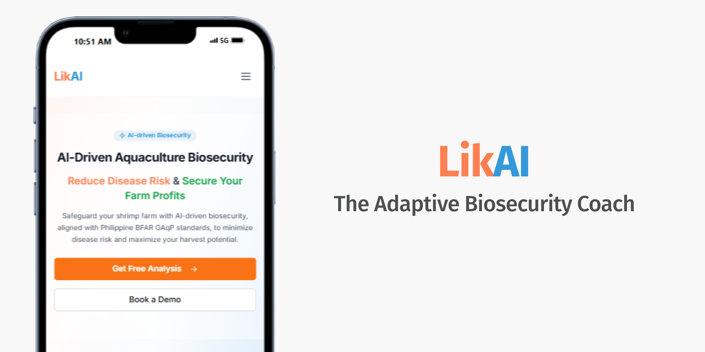
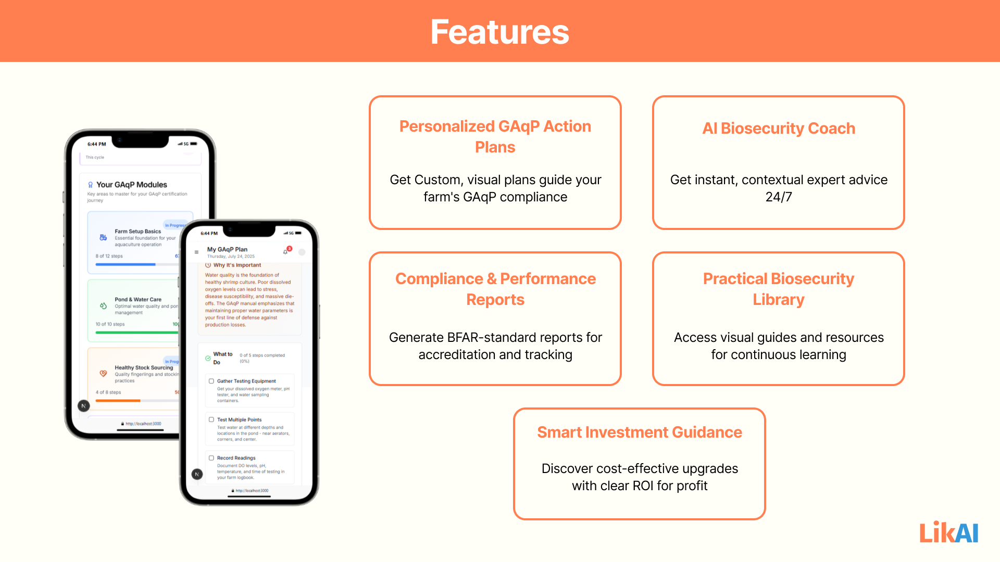
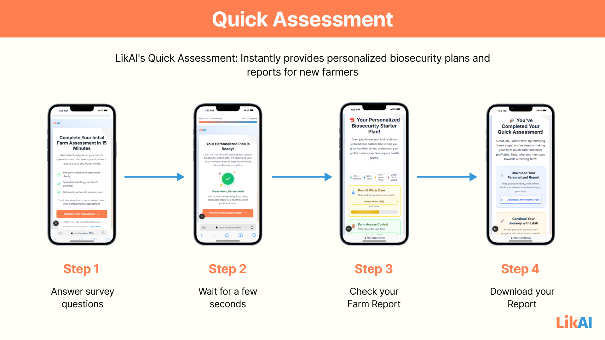
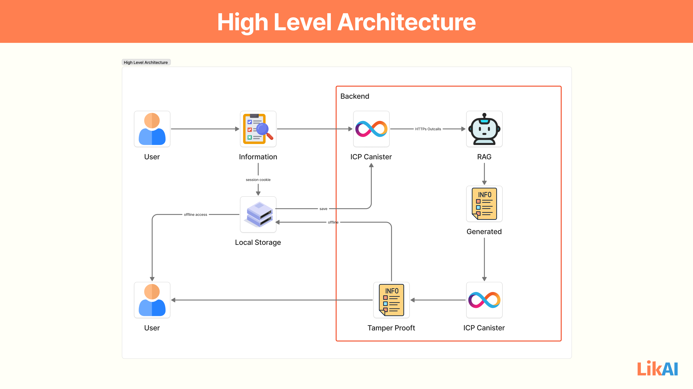
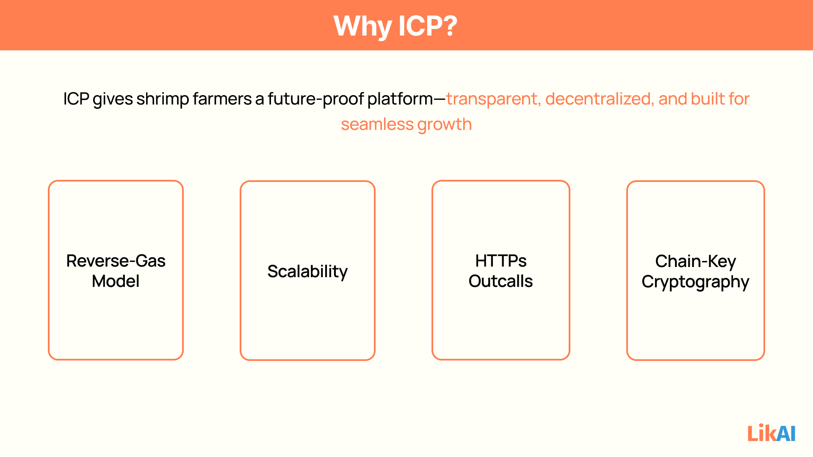

# LikAI: The Adaptive Biosecurity Coach



LikAI is an AI-driven biosecurity coach designed for small and medium-sized shrimp farmers. It transforms complex GAqP (Good Aquaculture Practices) into personalized, adaptive, and affordable action plans, empowering farmers to build resilient operations and secure profitable harvests.

<br>

## Mainnet Deployment

- Frontend Canister: https://hgn4e-xyaaa-aaaas-qbh6a-cai.icp0.io/
- Backend Canister: https://a4gq6-oaaaa-aaaab-qaa4q-cai.raw.icp0.io/?id=htknj-wqaaa-aaaas-qbh5q-cai

<br>

## GitBooks Documentation

We also created our full project documentation using GitBooks
Link: [LikAI Project Documentation](https://sentient-solutions.gitbook.io/likai-ai-biosecurity-coach/)

Contents
- ✅ Project Overview
- ✅ Features
- ✅ High Level Architecture
- ✅ Detailed Architecture
- ✅ Retrieval Augmented Generation (RAG) Architecture
- ✅ User Flow Diagram
- ✅ ICP Features used
- ✅ Deployment Guide

<br>

## Features



- **Personalized Farm Assessment:** 
   - Step-by-step onboarding flow collects farm data and generates a custom biosecurity report.
- **Actionable Recommendations:** 
   - AI-powered suggestions for pond care, stock sourcing, farm access control, and disease readiness.
- **Interactive How-To Guides:** 
   - Visual and checklist-based guides for key farm tasks, with integrated AI chat support.
- **Progress Tracking:** 
   - Dashboard to monitor completion of biosecurity tasks and overall farm health.
- **Compliance & Certification:** 
   - Automated compliance reports for BFAR accreditation and export standards.
- **Offline Access:** 
   - Downloadable PDF reports for field reference.
- **AI-Powered Assessment and Chatbot:** 
   - Personalized biosecurity plans and 24/7 AI coaching. See [docs/ai-features.md](docs/ai-features.md) for details.

<br>

## Demo Pictures



<br>

## High Level Architecture



This diagram illustrates Likai's robust, hybrid architecture, combining the power of the Internet Computer Protocol (ICP) for secure, decentralized backend operations with client-side capabilities for enhanced user experience, including offline access, and external AI integration.

<br>

## How Likai's Features Leverage ICP



- Personalized Biosecurity & GAqP Action Plans: 
   - The plan generation logic and the storage of the farmer's assessment data and the resulting dynamic plan would be in canisters. The plan's evolution is tamper-proof.
- AI Coach & Knowledge Assistant: 
   - The chat interface, chat history, and the logic for contextualizing prompts for external LLMs (via HTTPs outcalls) would be canister-based. The "Practical Biosecurity Library" content itself could be hosted in canisters for immutability.
- Smart Investment Guidance: 
   - The logic for calculating ROI, generating investment recommendations, and storing the farmer's investment plans would run in canisters.
- Compliance & Market Access (Future/Enterprise): 
   - The generation of compliance reports and the storage of certification data would leverage canisters for immutable record-keeping and verifiable outputs.

<br>

## Getting Started

### Prerequisites

- Node.js (v18+ recommended)
- npm or yarn

### Installation

1. **Clone the repository:**

   ```sh
   git clone https://github.com/your-org/likai.git
   cd likai
   ```

2. **Install dependencies:**
   - Use the DevContainer to create a container with the preconfigured installation. There should be a prompt in the editor in which you can install a Dev Container and open the project in the Container
   - Wait for the installation to finish.

3. **Configure environment variables:**
   - Copy `.env.example` to `.env.local` and set your API keys (e.g., `OPENAI_API_KEY`).

4. **Run the development server:**
   - the project is configured to rely on the local dfx network to enable the icp internet identity authorization. Please head over to the Running on the Local DFX NETWORK section.


   ```sh
   # to be able to run the development server without errors, please use the commands below.

   npm run dfx:start # to start a local replica of the dfx network
   npm run dfx:deploy # to deploy the canisters on local
   # or
   yarn dfx:start
   yarn dfx:deploy

   # after the canisters are deployed, you can start the development server by using the commands below:
   
   npm run dev
   # or
   yarn dev
   ```

5. **Open [http://localhost:3000](http://localhost:3000) in your browser.**

<br>

## Running on the Local DFX NETWORK

**To run the project in a local dfx network, you can use the command below**

- The project container is pre-configured to run the installation scripts, and the local links are not accessible if the codespaces are ran in the web.
- To Start, create a codespace of this repository, and make sure you run it on the VS Code Desktop 

```sh
npm run deploy:local
```

<br>

## Modules

- **Farm Setup Basics:** Legal, environmental, and infrastructure requirements.
- **Pond & Water Care:** Water quality management, pond preparation, aeration, and effluent handling.
- **Healthy Stock Sourcing:** Accredited hatchery sourcing, quarantine, and stocking protocols.
- **Farm Access Control:** Visitor management, disinfection stations, and equipment hygiene.
- **Disease Readiness:** Health monitoring, emergency response, and veterinary compliance.

See [docs/modules.md](docs/modules.md) and [docs/ai-features.md](docs/ai-features.md) for full module and AI details.

<br>

## Data Model

The system uses a multi-entity data model for farm, assessment, planning, and reporting. See [docs/onboarding-erd.md](docs/onboarding-erd.md) for the ERD and entity descriptions.

<br>

## API Endpoints

- `/api/generate-assessment-plan` – Generates biosecurity tasks based on farm data.
- `/api/generate-plan` – Creates detailed action plans for risk factors.
- `/api/generate-how-to` – Produces step-by-step guides for farm tasks.
- `/api/chat-how-to` – AI chat support for how-to guides.
- `/api/submit` - Allows submission of onboarding form data to be sent towards the AI

<br>

## Contributing

1. Fork the repository.
2. Create your feature branch (`git checkout -b feature/my-feature`).
3. Commit your changes (`git commit -am 'Add new feature'`).
4. Push to the branch (`git push origin feature/my-feature`).
5. Open a pull request.

## License

This project is licensed under the MIT License.
