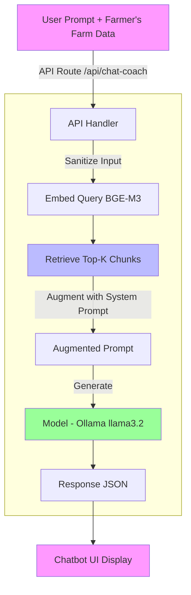

# LikAI AI Features

LikAI leverages AI to empower shrimp farmers with personalized biosecurity guidance. This document details the core AI components: the Farm Assessment AI and the Interactive Chatbot AI.

## Overview

- **AI Integration**: Built with LangChain for orchestration, Ollama for local LLM (Llama 3.2), and BGE-M3 embeddings.
- **Benefits**: Tailored advice based on farm data, 24/7 support, and compliance with GAqP standards.
- **ICP Leverage**: Plans and chat history stored in canisters for immutability.

## AI in Farm Assessment

### Purpose

Generates customized biosecurity and GAqP action plans from user inputs.

### How It Works

1. User submits farm details (e.g., size, location, risks) via `src/features/assessment/farm-assessment-form.tsx`.
2. AI processes data through `/api/generate-assessment-plan` to create step-by-step plans.
3. Plans evolve tamper-proof in ICP canisters.

### Key Inputs

- Farm profile (size, location).
- Risk factors (diseases, resources).

### Benefits

- Affordable, incremental recommendations.
- Visual progress tracking.

## AI in Chatbot

### Purpose

Provides instant, contextual biosecurity advice via the AI Coach.

### How It Works

RAG-based system:

- Knowledge base: Vectorized GAqP PDFs and Shrimp Roadmap in a Vector DB.
- Query flow: Embed user prompt, retrieve chunks, augment with system prompt, generate response.
- Exposed via `/api/chat-coach`.

### Response Format

JSON with embedded Markdown:

```json
{
  "response": "## Advice\n- Step 1: ...",
  "sources": ["GAqP Doc"],
  "status": "success"
}
```

### Architecture



## Future Enhancements

- Multi-modal input (photos).
- Cloud deployment for Ollama.
- Expanded knowledge base.
