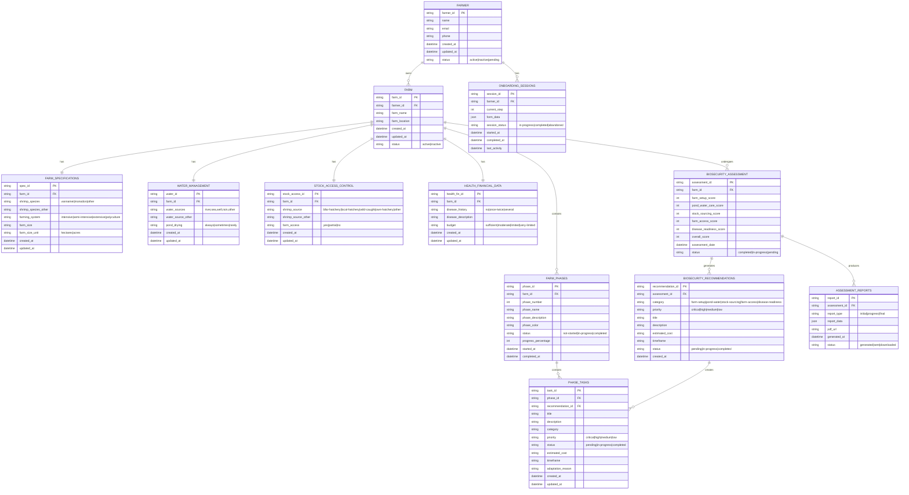

# LikAI Farm Assessment System - Entity Relationship Diagram

This ERD represents the data model for the farm onboarding and assessment system based on the OnboardingPage component.

## Mermaid ERD Code

## Entity Descriptions

### Core Entities

1. **FARMER**: The main user/owner of the farm
2. **FARM**: The physical farm location and basic information
3. **FARM_SPECIFICATIONS**: Technical details about farming operations
4. **WATER_MANAGEMENT**: Water sources and pond management practices
5. **STOCK_ACCESS_CONTROL**: Shrimp sourcing and farm security measures
6. **HEALTH_FINANCIAL_DATA**: Disease history and financial capacity

### Assessment & Planning Entities

7. **BIOSECURITY_ASSESSMENT**: Calculated scores across 5 key areas
8. **BIOSECURITY_RECOMMENDATIONS**: Generated improvement suggestions
9. **FARM_PHASES**: Journey-based implementation phases
10. **PHASE_TASKS**: Individual actionable tasks within phases
11. **ASSESSMENT_REPORTS**: Generated PDF reports and analytics
12. **ONBOARDING_SESSIONS**: Session management for multi-step form

## Key Data Flow

1. **Onboarding**: FARMER → ONBOARDING_SESSIONS → FARM creation
2. **Assessment**: FARM data → BIOSECURITY_ASSESSMENT → Scoring algorithm
3. **Planning**: BIOSECURITY_RECOMMENDATIONS → FARM_PHASES → PHASE_TASKS
4. **Execution**: PHASE_TASKS progress tracking → Updated scores
5. **Reporting**: ASSESSMENT_REPORTS generation and delivery

## Scoring Algorithm Entities

The scoring system evaluates farms across 5 dimensions:

- **Farm Setup Basics** (species + system selection)
- **Pond & Water Care** (water sources + pond management)
- **Healthy Stock Sourcing** (quality of shrimp sources)
- **Farm Access Control** (biosecurity protocols)
- **Disease Readiness** (history + financial preparedness)

Each area is scored 0-100 based on best practice criteria defined in the `calculateBiosecurityScores()` function.
