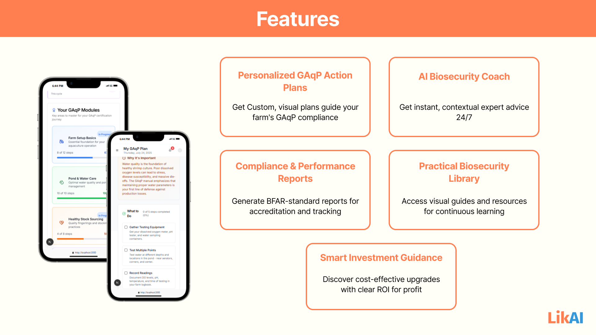

# LikAI Web Application Features

## Core Features

### 1. Personalized Biosecurity & GAqP Action Plans (Visual Step-by-Step Guides)

- This feature is the heart of LikAI's coaching. Upon completing a quick farm assessment, LikAI's AI meticulously analyzes the farmer's unique profile, including farm type, species, current practices, and resource constraints. It then generates a customized, step-by-step action plan for implementing Good Aquaculture Practices (GAqP) and robust biosecurity measures. 

- This plan is presented through intuitive visual guides, breaking down complex protocols into clear, actionable tasks. The AI dynamically adapts this plan based on the farmer's progress and any new challenges, ensuring the guidance is always relevant and leads them through a structured journey towards a BFAR-certified farm.

### 2. AI Coach & Knowledge Assistant 

- Serving as an always-on expert, this feature provides farmers with instant, personalized support directly through a friendly chatbot interface. Whether a farmer has a routine question about a biosecurity step or faces an emergency situation, the AI Coach offers expert-level guidance and troubleshooting advice 24/7. 
- Leveraging advanced AI, it provides context-aware recommendations tailored to the farm's specific conditions and plan, and offers multi-format support, allowing farmers to ask questions via text, attach photos of symptoms, or use quick suggestion buttons for effortless interaction.

### 3. Smart Investment Guidance

- LikAI empowers farmers to make informed financial decisions that directly impact their farm's health and profitability. This feature utilizes AI to analyze the farmer's budget and desired improvement areas, generating resource-optimized recommendations for biosecurity upgrades. It provides clear estimated costs for each upgrade, often suggesting practical, low-cost, or DIY alternatives, and crucially, projects the Return on Investment (ROI). 
- This ensures that every biosecurity investment is strategically sound and contributes directly to the farm's financial success.

### 4. Practical Biosecurity Library 

- This feature acts as a comprehensive, accessible knowledge hub, empowering farmers to continuously learn and solve challenges independently. It offers a vast collection of GAqP-aligned aquaculture resources, including searchable expert guides, detailed step-by-step tutorials, and engaging visual demonstrations (such as videos). 
- Organized by clear categories that mirror the farm's GAqP journey modules, the library ensures farmers can easily find relevant, practical information to deepen their understanding and confidently implement best practices.

## Other Features

### Offline Support

- Allows farmers to access their personalized GAqP action plans, step-by-step guides, and critical emergency protocols even when internet connectivity is unreliable or absent in remote farm locations. 
- This vital capability ensures that essential biosecurity practices can be consistently followed and urgent responses can be initiated without delay, directly contributing to minimizing disease outbreaks and safeguarding farm profitability by enabling uninterrupted compliance.

### Mobile-Friendly UI

- The app boasts a clean, intuitive, and visually appealing interface with large, tappable elements, clear icons, and concise language, ensuring that navigating complex GAqP information feels effortless and direct. 
- This user-centric design significantly reduces the learning curve and friction, empowering farmers to easily understand and consistently implement best practices, thereby boosting farm productivity, enhancing overall compliance, and ultimately contributing to a more stable and profitable livelihood.