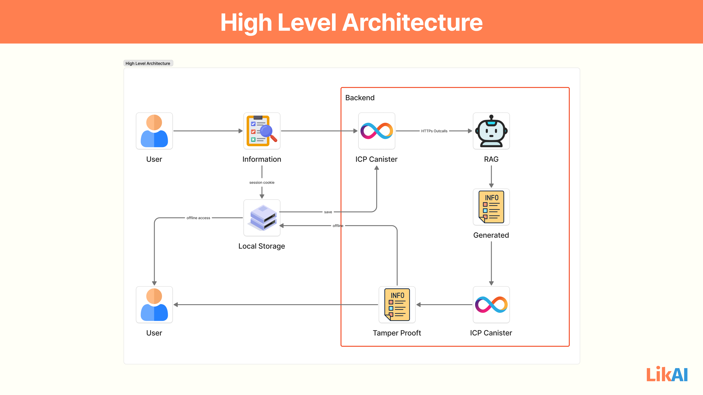

# Likai Architecture: Detailed Phase-by-Phase Explanation

This diagram illustrates Likai's robust, hybrid architecture, combining the power of the Internet Computer Protocol (ICP) for secure, decentralized backend operations with client-side capabilities for enhanced user experience, including offline access, and external AI integration.

## Phase 1: User Interaction and Initial Data Capture

1. **User Input ("User" to "Information"):**
    - The process begins with the **User** interacting with the Likai mobile application. This involves inputting farm-specific data (e.g., pond size, species, current conditions), asking questions to the AI coach, or initiating a request for a GAqP action plan. This input is represented by the "Information" box, which signifies the data collected from the user interface.
2. **Client-Side Caching ("Information" to "Local Storage"):**
    - The collected "Information" is immediately stored in **Local Storage** on the user's device. This serves as a client-side cache, crucial for providing a seamless user experience and enabling offline functionality. It ensures that the app remains responsive even with intermittent network connectivity.

## Phase 2: Data Persistence and Offline Capability

1. **Offline Access ("Local Storage" to "User"):**
    - A key feature of Likai is its **Offline Access**. If the user loses internet connection, they can still view their previously saved plans, guides from the Practical Biosecurity Library, and other critical farm data directly from "Local Storage." This ensures continuous access to vital information even in remote farming areas.
2. **Backend Synchronization ("Local Storage" to "ICP Canister" - "save" link):**
    - When an internet connection is available, data from "Local Storage" is securely synchronized and "saved" to the **ICP Canister** residing on the Internet Computer. This ensures that all user data, farm records, and progress are persistently stored on a decentralized, tamper-proof blockchain backend.

## Phase 3: AI Processing and External Integration (The "Backend" Layer)

1. **Backend Orchestration ("Backend" Boundary):**
    - The red box denotes the **Backend** of the Likai system, which is entirely hosted on the Internet Computer. This signifies that all core logic, data processing, and AI orchestration happen within this secure, decentralized environment.
2. **AI Request Initiation ("ICP Canister" to "Robot (AI)" via "HTTPs Outcalls"):**
    - When the user requests AI-driven features (e.g., a personalized GAqP plan, contextual advice from the AI coach), the primary **ICP Canister** processes this request. To leverage advanced Large Language Models (LLMs) that might be hosted externally, this ICP Canister initiates an **HTTPs Outcall**. This unique ICP feature allows smart contracts (canisters) to securely make requests to traditional Web2 services over the internet. The "Robot (AI)" represents this external LLM service.
3. **AI Generation ("Robot (AI)" to "Generated"):**
    - The "Robot (AI)" (the external LLM) receives the prompt from the ICP Canister via the HTTPs Outcall. It then processes the request and generates the necessary output, such as a customized GAqP plan, specific biosecurity recommendations, or a detailed farm report. This output is represented as "Generated" information.
4. **AI Response & Canister Processing ("Generated" to "ICP Canister"):**
    - The "Generated" content (the AI's response) is then sent back to an **ICP Canister**. This is the response to the initial HTTPs Outcall. The ICP Canister receives this data, performs any necessary post-processing (e.g., formatting, validation), and integrates it into the user's farm profile or plan.

## Phase 4: Secure Data Storage and User Retrieval

1. **Tamper-Proof Storage ("ICP Canister" to "Tamper Proof"):**
    - Once the AI-generated information is processed and stored within the **ICP Canister**, it becomes inherently **Tamper Proof**. This is a fundamental property of the Internet Computer blockchain, where data cannot be altered or deleted once recorded, providing unparalleled data integrity and trust for farmers.
2. **Secure User Retrieval ("Tamper Proof" to "User"):**
    - Finally, the "Tamper Proof" and securely stored information is retrieved from the ICP Canister and delivered back to the **User**'s device, where it can be displayed in the Likai app. This ensures that farmers always receive accurate, verifiable, and secure guidance and reports.