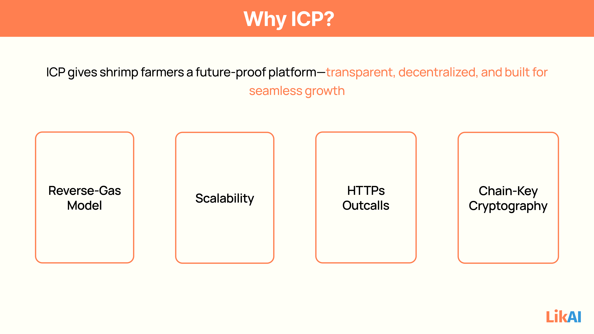

## ICP Features 

### How LikAI's Features Leverage ICP:

Personalized Biosecurity & GAqP Action Plans: The plan generation logic and the storage of the farmer's assessment data and the resulting dynamic plan would be in canisters. The plan's evolution is tamper-proof.

#### 1. Personalized Biosecurity & GAqP Action Plans:

- The plan generation logic and the storage of the farmer's assessment data and the resulting dynamic plan would be in canisters. The plan's evolution is tamper-proof.

#### 2. AI Coach & Knowledge Assistant:

- The chat interface, chat history, and the logic for contextualizing prompts for external LLMs (via HTTPs outcalls) would be canister-based. The "Practical Biosecurity Library" content itself could be hosted in canisters for immutability.

#### 3. Smart Investment Guidance:

- The logic for calculating ROI, generating investment recommendations, and storing the farmer's investment plans would run in canisters.

#### 4. Compliance & Market Access (Future/Enterprise):

- The generation of compliance reports and the storage of certification data would leverage canisters for immutable record-keeping and verifiable outputs.

 

### Core Features

#### **Canisters (Smart Contracts as Web Services):**

Whitepaper Reference: "Canisters can store data, perform very general computations on that data, and provide a complete technology stack, serving web pages directly to end users."

LikAI Integration:

- Full Stack Hosting: The entire LikAI application – its frontend (the UI the farmer sees), backend logic, and data storage – can reside entirely within canisters on the ICP network. This eliminates reliance on centralized cloud providers (AWS, Azure, Google Cloud) and their associated single points of failure, downtime, and censorship risks.
- AI Logic & Data Processing: The core logic for generating personalized action plans, adapting plans, processing farm assessment inputs, and managing the state of biosecurity modules would be executed within canisters.
- User Profiles & Farm Data: Each farmer's profile, their personalized GAqP plan, progress tracking, completed tasks, and historical data (e.g., water quality logs, disease incidents) would be stored directly within canisters.

Benefit for LikAI: 

- Unstoppable, tamper-proof, and censorship-resistant application operation. Farmers' sensitive data is secured on a decentralized public network, not a private corporate server.

#### **Reverse-Gas Model (Cycles):**

Whitepaper Reference: "Computational and storage costs are covered by a 'reverse-gas model', where canister developers pre-pay costs in cycles that are obtained from ICP, the native token of the IC."

LikAI Integration: 

- LikAI (as the developer/service provider) would pre-pay for the computation and storage consumed by its canisters. Farmers do not need to hold or pay with crypto tokens directly for using the app (unlike traditional blockchain dApps).

Benefit for LikAI: 

- Provides predictable and stable operational costs, making the business model more viable. Crucially, it creates a seamless, traditional web2-like user experience for farmers who don't need to understand crypto wallets or gas fees. This is vital for farmer adoption.

#### **Chain-Key Cryptography (Threshold Signatures & Output Authentication):**

Whitepaper Reference: "an individual output of one subnet may be verified by another subnet or external user by simply validating a digital signature with respect to the public signature-verification key of the (first) subnet." Also used to "certify the replicated state."

LikAI Integration:

- Data Authenticity: Any data served by LikAI's canisters (e.g., a farmer's personalized GAqP plan, their biosecurity score, or a generated investment report) can be cryptographically authenticated by the user's client (e.g., their web browser) directly from the blockchain.
- Secure Interactions: Ensures that messages between canisters (e.g., if one canister manages user profiles and another manages GAqP plans) are secure and verifiable.

Benefit for LikAI: 

- Provides unmatched data integrity and trust. Farmers can be absolutely certain that the information they see in the app is genuinely from LikAI and has not been tampered with. This builds immense confidence in the advice provided.

#### **HTTPs Outcalls:**

Whitepaper Reference: "This feature allows canisters to send HTTPs requests arbitrary web pages (external to the IC) and process the response after it has been agreed upon by consensus."

LikAI Integration: 

- While LikAI's core AI logic runs on ICP, the most powerful Large Language Models (LLMs) like Gemini might be too large or complex to run entirely within a single canister in the MVP phase. HTTPs outcalls allow LikAI's canisters to securely send prompts to external LLM APIs (like Gemini's API) and receive their responses.

Benefit for LikAI: 

- Enables LikAI to leverage the cutting-edge capabilities of external, large-scale AI models while still maintaining the core application logic and data on ICP.