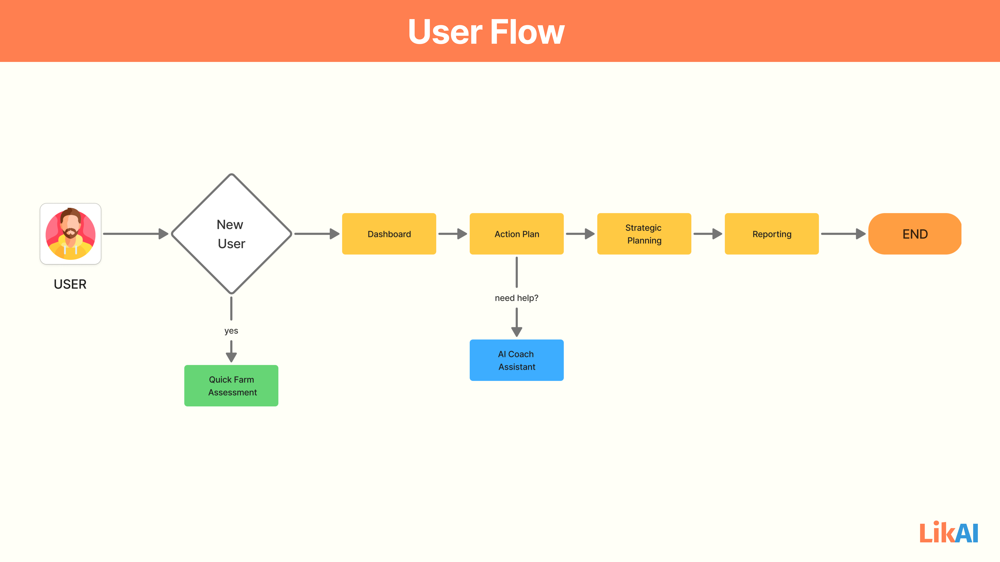

# User FLow Diagram

## Quick Start - Initial Assessment & Personalized Plan

- Farmers provide essential details about their farm through a simple, intuitive, and visually guided questionnaire. Likai's AI then rapidly analyzes this information to generate a personalized biosecurity starter plan.

- This phase culminates in the immediate delivery of a customized action plan report, which farmers can download for offline reference or choose to access directly within the app, setting the foundation for their GAqP journey.

## Feature 1: The Central Hub - Understanding Farm Health

- Farmers land on their personalized Dashboard, the central hub of their GAqP journey. This screen provides an immediate, visual overview of their farm's overall biosecurity health and progress through their GAqP modules. It prominently displays their overall score, individual module progress, and highlights their most critical next actions, ensuring farmers quickly grasp their farm's status and immediate priorities for improvement.

## Feature 2: Diving into the Plan - Action & Guidance From the Dashboard

- Farmers seamlessly transition into their "My GAqP Plan" to focus on specific actions. Whether clicking on a highlighted "Next Action" or selecting a particular GAqP module, the plan adapts to show relevant, step-by-step visual guides for tasks.

- Farmers can easily mark tasks complete, with immediate visual feedback updating their progress, and access the AI Coach & Knowledge Assistant for instant, contextual support on any step or challenge.

## Feature 3: Deepening Knowledge & Strategic Planning

- Empowers farmers with comprehensive resources and financial insights. They can explore the "Practical Biosecurity Library" to deepen their understanding of GAqP aspects through visual guides and tutorials, or utilize "Smart Investment Guidance" to receive AI-driven recommendations for cost-effective farm upgrades with clear ROI projections, all designed to strategically boost farm profitability.

## Feature 4: Review & Compliance (Reporting)

- Focuses on review and formal compliance. Farmers can easily access the "Reports" section to generate comprehensive documentation of their farm's performance and biosecurity adherence. These reports are formatted for internal review or for official purposes like BFAR accreditation, enabling farmers to demonstrate their commitment to GAqP and unlock new market opportunities.